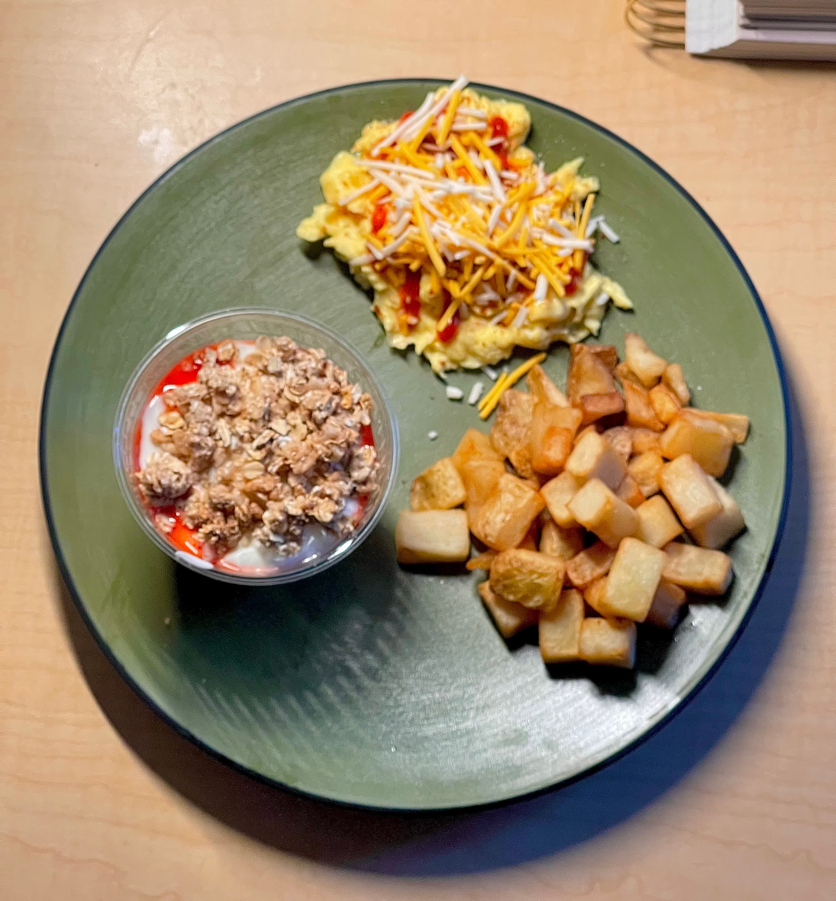
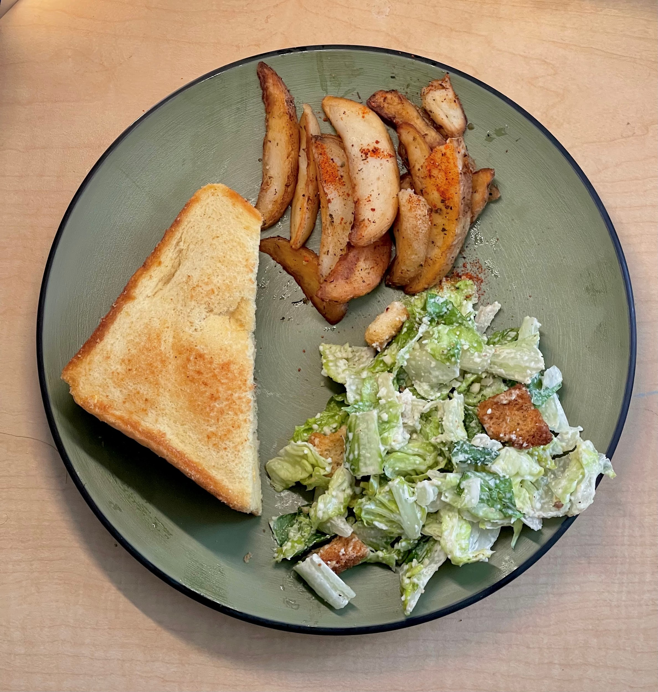
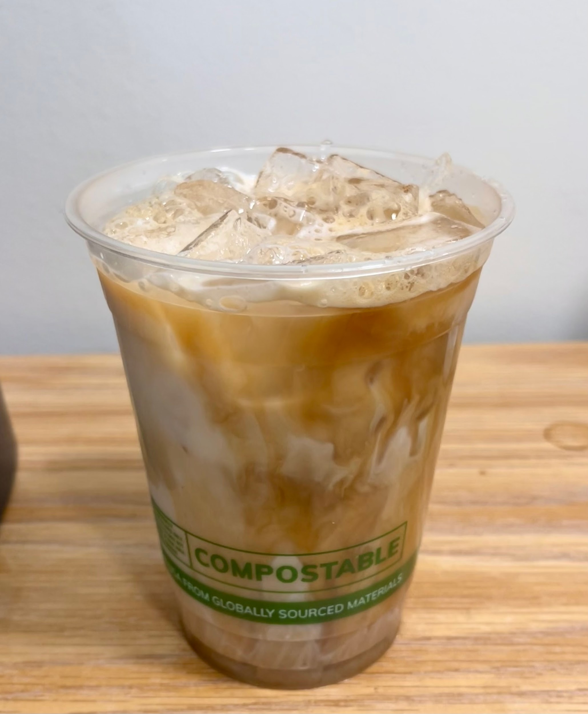
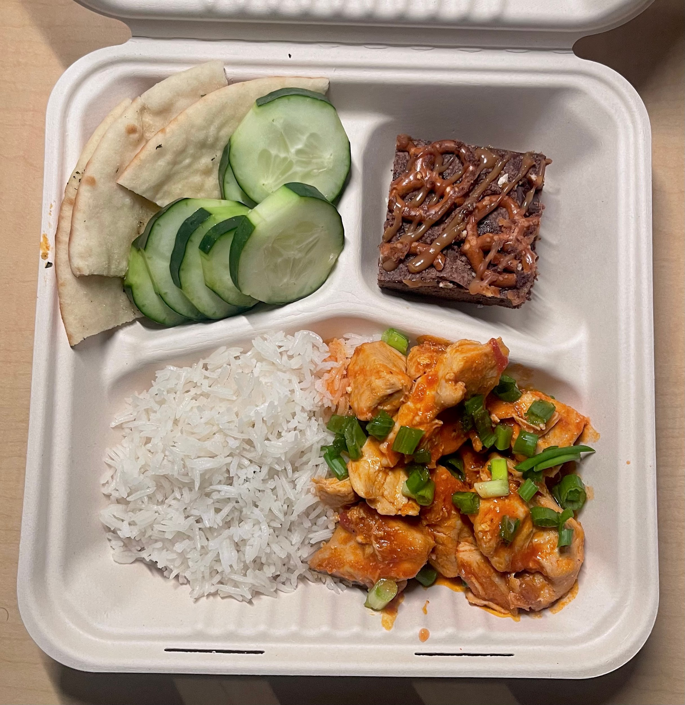

**A DAY OF HALAL EATS ON CAMPUS --- SOUTH SERVERY EDITION**

*Duaa Mushahid*

*Salam Alaikum!*

Houston is a city known for its flavorful, never-ending options, and
Rice, located in the heart of the city, boasts tons of halal food spots
nearby. However, eating on campus is a huge part of daily life at Rice,
especially for students living at their residential colleges. For Muslim
students, having halal options that are clear, filling, and genuinely
enjoyable makes a real difference. South Servery, which connects to
Wiess and Hanzen College, and is one of the five dining halls on campus,
can be counted on to provide solid options for its Muslim students. Here
is what a full day of halal eating at South looks like.

***Breakfast***

On days when I have early classes, I usually start my morning at South.
Today, we had homestyle breakfast potatoes and fluffy scrambled eggs,
which I topped with cheese and sriracha. I also made a strawberry Greek
yogurt parfait with granola. If I'm running late, I'll save the parfait
for later and have it as a midday snack between classes. It's quick and
easy to grab.

{width="2.3552832458442694in"
height="2.5364588801399823in"}

***Lunch***

On this day, South kept things simple for lunch. I had a grilled cheese
sandwich, and paired it with potato wedges seasoned with sriracha, which
added just the right amount of spice. On the side, I added a Caesar
salad, which can always be found at the salad bar.

{width="2.4843755468066493in"
height="2.6117793088363954in"}

***Afternoon Coffee***

Although there are various coffee shops on campus, the dining halls also
make sure to include a coffee bar if you'd like to make your drinks
yourself. In the afternoon, South becomes my go-to stop for a quick pick
me up drink. I made myself an iced salted honey latte, which has quickly
become a favorite. It's sweet without being overwhelming and perfect for
Houston heat. South has a coffee station close to the Hanzen entrance,
which includes different syrups, sauces, and milk options that you can
choose from to make a custom drink for yourself.

{width="2.520145450568679in"
height="3.057292213473316in"}

***Dinner***

Dinner is usually the highlight of the day, both for the food options,
and for the chance to catch up with friends. Today, we visited the Owl
Masala station for rice with Kashmiri chicken rogan josh, topped with
spring onions from the condiments bar. I added a side of garlic naan and
some sliced cucumbers to keep things fresh. For dessert, we finished
with a salted caramel pretzel brownie. It was the perfect way to end the
day.

{width="2.6212948381452317in"
height="2.6927088801399823in"}

For Muslim students, knowing there is a place where you can eat
confidently without explaining or compromising makes daily life a little
lighter. South Servery does its best to be that space, and for Muslim
students at Rice, that matters.

We hope you enjoy your time on campus as much as we do!

Warmly,

Rice MSA
